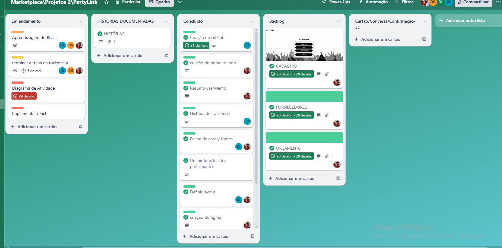
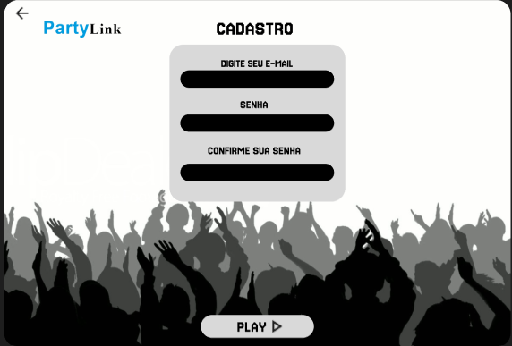
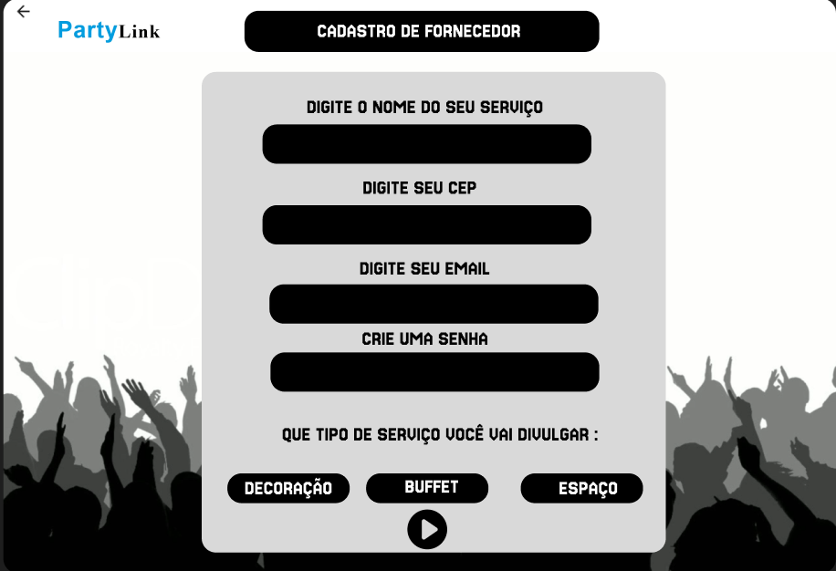
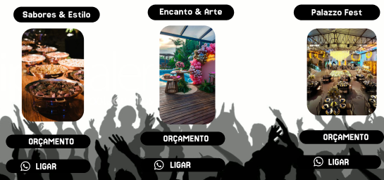
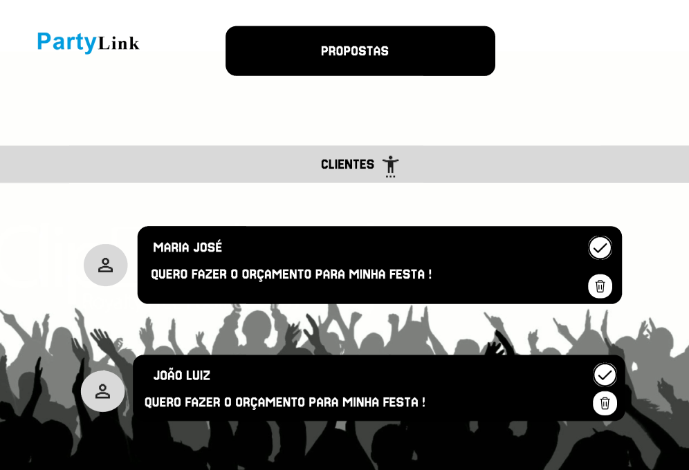

# PartyLink

## O que é ?
O PartyLink é um marketplace digital que fornece uma conexão entre clientes e fornecedores. A ideia é que um usúario como cliente faça propostas para fornecedores de eventos , exemplo, um fornecedor de comidas, bebidas, roupas, etc..., Assim , o cliente faz seu evento do jeito que achar melhor, e fornecedores vendem seus produtos, e divulgam seu trabalho.

## Quadro e Backlog no Trello

## Protótipo do Figma
[Ver protótipo do Figma](https://www.figma.com/design/kLCXuvtk9LYKbZEaosKdjm/Market-Place?node-id=0-1&m=dev&t=wAsaRvRU5EYYFpAV-1)

### Screencast

Primeiramente o usuário entra no app, faz o login de sua conta no botão com descrição (clique aqui), caso não tenha uma conta clique na opção criar,entra na tela de cadastro, há duas opções de cadastro, uma para cliente outro para fornecedor, o usuário escolhe qual opção deseja, e faz o cadastro(Para cada tipo de usuário há um formulário diferente a ser preenchido). Assim que criar sua conta o usuário pode fazer o login.

#### Tela principal do usuário cliente

##### Cabeçalho

Como cliente a tela terá um cabeçalho contendo foto de perfil, logo da Partylink,e um espaço para pesquisa, respectivamente. Ao clicar na foto de perfil o usuário pode modificar informações do perfil,ao clicar no logo o usuário recarrega a página para a tela principal, em pesquisa o cliente pode buscar por fornecedores, a partir do nome correto da empresa ou pessoa.  

##### Principal

Nessa areá aparecerá as categorias presentes no mercado,como, comida,bebidas,roupas,etc, ao clicar em uma dessas opções o usuário filtra os fornecedores do produto que escolheu.Além de uma seção contendo fornecedores presentes no app, e caso o cliente se interesse no produto, pode entrar em contato e fazer uma proposta dos produtos que deseja comprar.

# Diagrama de atividades

.jpeg)

# Protótipos de Lo-Fi (figma)

## Tela de Cadastro usuário cliente

### Storyboards

Caso o usuário não tenha uma conta na partylink e deseja se cadastrar como cliente, basta responder o questionário. Posteriormente fazer login com sua nova conta, assim acessando a tela principal da plataforma

## Tela de Cadastro usuário fornecedor

### Storyboards

Caso o usuário não tenha uma conta na partylink e deseja se cadastrar como fornecedor, basta responder o questionário. Posteriormente fazer login com sua nova conta, assim acessando a tela principal da plataforma

## Tela de pesquisar por fornecedores

### Storyboards

No cabeçalho da tela principal há a opção do cliente pesquisar pelos fornecedores presentes na plataforma, basta pôr o nome correto da empresa ou pessoa fornecedora.

## Tela de visualizar fornecedores

### Storyboards

Na tela principal o cliente visualizará os fornecdores presentes na plataforma.

## Tela de visualização de propostas

### Storyboards

No cabeçalho da tela do usuário fornecedor haverá um simbolo de mensagens, lá vai está propostas, o fornecedor pode aceitar ou não. Clicando no botão de aceitar com icone de seta, ou recusar no icone de lixeira

# Programação em Par experimentada

Apesar das limitações de equipe e dificuldades que surgiram durante o desenvolvimento conseguimos entregar o projeto. Aprendemos usar uma nova ferramenta, o react. Foi uma experiência desafiadora, todavia boa

## Diagrama de Atividades

