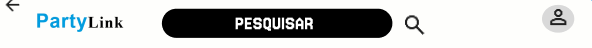
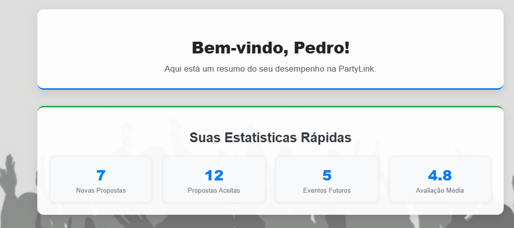

# PartyLink

## O que é ?
O PartyLink é um marketplace digital que fornece uma conexão entre clientes e fornecedores. A ideia é que um usúario como cliente faça propostas para fornecedores de eventos , exemplo, um fornecedor de comidas, bebidas, roupas, etc..., Assim , o cliente faz seu evento do jeito que achar melhor, e fornecedores vendem seus produtos, e divulgam seu trabalho.

## Quadro e Backlog no Trello

## Protótipo do Figma
[Ver protótipo do Figma](https://www.figma.com/design/kLCXuvtk9LYKbZEaosKdjm/Market-Place?node-id=0-1&m=dev&t=wAsaRvRU5EYYFpAV-1)

# Protótipos de Lo-Fi (figma)

## Tela de Cadastro usuário cliente

### Storyboards

Caso o usuário não tenha uma conta na partylink e deseja se cadastrar como cliente, basta responder o questionário. Posteriormente fazer login com sua nova conta, assim acessando a tela principal da plataforma

## Tela de Cadastro usuário fornecedor

### Storyboards

Caso o usuário não tenha uma conta na partylink e deseja se cadastrar como fornecedor, basta responder o questionário. Posteriormente fazer login com sua nova conta, assim acessando a tela principal da plataforma

## Tela de pesquisar por fornecedores

### Storyboards

No cabeçalho da tela principal há a opção do cliente pesquisar pelos fornecedores presentes na plataforma, basta pôr o nome correto da empresa ou pessoa fornecedora.

## Tela de visualizar fornecedores

### Storyboards

Na tela principal o cliente visualizará os fornecdores presentes na plataforma.

## Tela de visualização de propostas

### Storyboards

No cabeçalho da tela do usuário fornecedor haverá um simbolo de mensagens, lá vai está propostas, o fornecedor pode aceitar ou não. Clicando no botão de aceitar com icone de seta, ou recusar no icone de lixeira

## Tela experiência do usuário

### Storyboards

O usuário pode adicionar um comentario sobre sua expericiencia na plataforma

## Tela de orçamento, mensagem automatica

### Storyboards

O usuário pode fazer um orçamento, e terá uma mensagem automatica

## Tela do Dashboard

### Storyboards

O usuário como fornecedor tem como acessar a tela de dashboard e ver seu desempenho

# Programação em Par experimentada

 HEAD
Desde o inicío do projeto trabalhos juntos para o desenvolvimento da plataforma, juntando nossas ideias e soluções para póssiveis problemas. Alguns problemas surgiram que dificultou o desenolvivemento, como, tempo limitado, limitações tecnicas, e limitação na equipe, a qual era para ser formada com 4 pessoas, e no fim foi apenas dois.

Apesar das limitações de equipe e dificuldades que surgiram durante o desenvolvimento conseguimos entregar o projeto. Aprendemos usar uma nova ferramenta, o react. Foi uma experiência desafiadora, todavia boa

## Diagrama de Atividades

